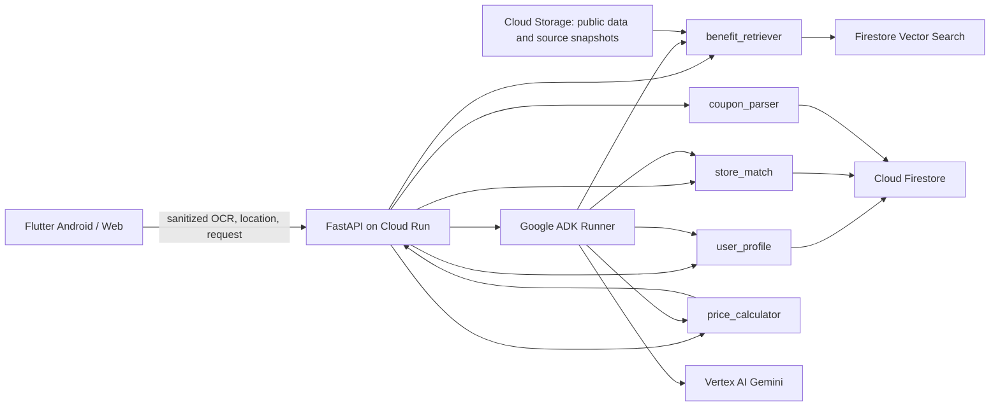

# 시스템 아키텍처

## 책임 분리

Flutter는 이미지 선택, Android 기기 내 OCR, 민감 문자열 마스킹, 위치/매장 입력, 추천 결과와 출처 표시를 담당합니다. Web 데모는 OCR과 실제 위치 대신 수동 입력/프리셋을 사용할 수 있습니다.

FastAPI는 요청 검증, 도구 오케스트레이션, Firestore 조회, RAG 검색, 결정적 계산과 응답 스키마화를 담당합니다. Gemini는 `coupon_parser`와 사용자 설명에만 참여하며 거리·금액을 계산하거나 calculator 결과를 수정하지 않습니다.

ADK 구현은 `backend/app/agents/coupon_kock_agent/`에 있으며, `root_agent`가 매장 매칭 → 사용자 혜택 조회 → 근거 검색 → 결정적 계산 도구를 호출합니다. FastAPI는 요청마다 임시 ADK 세션을 만들고 실행이 끝나면 삭제합니다.

## 주요 흐름

1. Flutter가 쿠폰 이미지를 기기 내에서 OCR합니다.
2. PIN/바코드 후보를 마스킹한 텍스트를 `/api/coupons/parse`에 전달합니다.
3. 위치 요청 시 서버가 Haversine 거리와 Brand Resolver로 주변 지원 매장을 찾습니다.
4. 사용자 프로필과 유효한 공식 문서만 필터링해 RAG Top-5를 검색합니다.
5. calculator가 가능한 쿠폰/카드/통신사 조합을 평가하고 최종 금액순으로 정렬합니다.
6. Gemini는 정렬을 바꾸지 않고 조건, 불확실성, 공식 출처를 설명합니다.

## MVP와 후속 구현 경계

- MVP: 포그라운드 위치 또는 위치 프리셋, 대표 브랜드 5~10개, 카드 3개 내외와 통신 3사 공식 문서
- 후속: 백그라운드 geofencing, 카드사 계정/잔여한도 연동, 모든 브랜드 자동 식별, 실제 결제 연동
