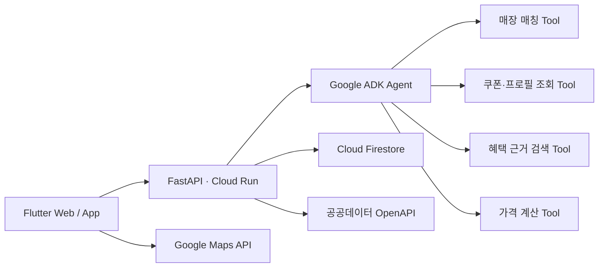

# 쿠폰콕
- 배포 링크: https://proj-aj25-211200020328.web.app/

## 프로젝트 개요

쿠폰콕은 사용자가 등록한 모바일 쿠폰과 현재 위치를 기반으로, 주변에서 쿠폰을 사용할 수 있는 매장을 탐색하고 예상 결제 금액을 추천하는 위치 기반 혜택 에이전트입니다.

LLM이 직접 거리와 할인 금액을 계산하지 않고, 매장 검색·쿠폰 조회·혜택 검색·가격 계산 도구를 호출하도록 구성했습니다. 거리와 금액처럼 정확성이 필요한 값은 결정적인 코드로 계산하고, Gemini는 도구 실행과 추천 근거 설명을 담당합니다.

- Web Demo: Firebase Hosting
- Backend API: Cloud Run
- API 문서: Swagger UI

## 개발 배경

모바일 쿠폰, 카드, 통신사 혜택은 서로 다른 앱과 문서에 흩어져 있어 사용자가 결제 직전에 가장 유리한 조합을 직접 판단하기 어렵습니다.

이를 해결하기 위해 다음 과정을 자동화하는 MVP를 개발했습니다.

```
현재 위치 확인
→ 보유 쿠폰 조회
→ 쿠폰 사용 가능 매장 필터링
→ 가까운 매장 Top 5 탐색
→ 할인 조합 계산
→ 에이전트가 추천 결과와 근거 설명
```

## 개발 기간

- 2026.08.07 ~ 2026.08.11
- 4일 MVP 개발

## 개발 인원 및 역할

- 개인 프로젝트
- 기획, UI, Flutter 프론트엔드, FastAPI 백엔드, ADK 에이전트, GCP 인프라와 배포 전 과정 담당

## 기술 스택

### Frontend

- Flutter / Dart
- `google_maps_flutter`
- `geolocator`
- `http`
- Firebase Hosting

### Backend 및 AI

- Python 3.11
- FastAPI / Pydantic / Uvicorn
- Google Agent Development Kit 2.6.3
- Vertex AI Gemini 2.5 Flash
- Deterministic discount calculator

### Cloud 및 데이터

- Google Cloud Run
- Cloud Build
- Artifact Registry
- Cloud Firestore
- Secret Manager
- Firebase Hosting
- Google Maps JavaScript API
- 소상공인시장진흥공단 상가정보 OpenAPI

### 테스트 및 품질 관리

- pytest
- Ruff
- flutter_test
- flutter analyze
- Git / GitHub

## 시스템 아키텍처

```

```

## 주요 구현 기능

### 1. 현재 위치 및 주변 매장 탐색

- 앱 시작 시 기기 위치 권한 요청
- 위치가 변경되면 최신 GPS 좌표 반영
- 현재 위치를 Google Map에 표시
- 백엔드에서 공공데이터포털 상가정보 API 호출
- 사용자 위치로부터 매장까지의 직선거리를 Haversine 공식으로 계산
- 가까운 매장 순으로 정렬하여 Top 5 표시
- 현재 위치와 검색된 매장이 모두 보이도록 지도 카메라 자동 조정

### 2. 사용자 쿠폰 등록 및 조회

- 브랜드, 상품명, 금액, 유효기간을 입력해 쿠폰 등록
- 등록된 쿠폰을 Cloud Firestore에 저장
- 사용자별 쿠폰 목록 조회
- 만료된 쿠폰을 주변 매장 검색과 추천 대상에서 제외
- 쿠폰 등록 직후 주변 매장 목록 자동 갱신

### 3. 쿠폰 사용 가능 매장 필터링

- 공공데이터에서 조회한 모든 매장을 그대로 노출하지 않고, 사용자가 보유한 유효 쿠폰 브랜드와 일치하는 매장만 유지
- 브랜드명과 매장명을 정규화하여 비교
- 필터링 이후 거리순으로 정렬하고 최대 5개만 반환
- 백엔드와 프론트엔드 양쪽에서 정렬을 검증

### 4. 결정적 가격 계산 Tool

- 쿠폰 금액, 카드 할인율, 할인 한도와 중복 적용 가능 여부를 입력받아 가능한 결제 조합 계산
- 모든 후보를 최종 결제금액 기준으로 정렬
- 여러 쿠폰을 임의로 합산하지 않고 유효한 한 장만 적용
- LLM이 계산 결과를 임의로 변경하지 못하도록 에이전트 프롬프트에서 제한

### 5. Google ADK 기반 혜택 추천 에이전트

다음 도구를 순서대로 호출하는 ADK 에이전트를 구성했습니다.

- `match_nearby_store`: 현재 위치에서 매장 탐색
- `load_user_benefit_context`: 사용자의 유효 쿠폰과 프로필 조회
- `retrieve_official_benefit_rules`: 공식 카드·통신사 혜택 근거 조회
- `calculate_discount_options`: 가능한 할인 조합 및 최저 결제금액 계산

에이전트는 계산 결과를 바꾸지 않고 다음 내용을 한국어로 설명합니다.

- 추천 옵션
- 예상 결제금액과 절감액
- 적용된 쿠폰·카드·통신사 혜택
- 확인이 필요한 실적·한도·중복 조건
- 공식 근거 연결 상태

### 6. 에이전트 실행 추적

- 에이전트 요청별 `request_id`, `session_id` 생성
- 도구 호출 및 완료 순서를 `tool_trace`로 반환
- 요청마다 임시 ADK 세션을 생성하고 응답 후 삭제
- 사용자 위치와 쿠폰 정보가 장기간 세션에 남지 않도록 설계

### 7. 개인정보 및 비밀정보 보호

- 쿠폰 PIN과 바코드를 API 스키마에 포함하지 않음
- 정확한 사용자 위치와 OCR 원문을 서버 로그에 기록하지 않도록 설계
- 공공데이터 인증키를 Flutter에 포함하지 않고 Cloud Run 백엔드에서만 사용
- API 인증키는 Secret Manager에 저장
- Cloud Run 런타임 서비스 계정에 필요한 Secret 접근 권한만 부여

## 설계 완료 및 확장 예정 기능

다음 기능은 구조와 Tool 인터페이스까지 설계했지만 1차 MVP에서는 완전한 운영 데이터 연동 전 단계입니다.

### 쿠폰 OCR

- 쿠폰 이미지에서 브랜드, 상품명, 금액, 유효기간 추출
- 쿠폰 PIN과 바코드 후보 문자열 마스킹
- 현재는 수동 등록 및 placeholder parser 제공
- 후속 단계에서 Android ML Kit 또는 Vertex AI 기반 OCR 연결 예정

### 카드·통신사 혜택 RAG

- 공식 카드사·통신사 혜택 문서를 수집하고 청크 단위로 가공
- 임베딩 후 Firestore Vector Search에서 관련 근거 검색
- 출처와 유효기간이 확인된 규칙만 가격 계산기에 전달
- 현재는 공식 근거가 없으면 `no_evidence`를 반환하여 임의 할인을 차단

### 사용자 카드·통신사 프로필

- 카드번호가 아닌 카드 상품명과 통신사만 저장
- 전월 실적과 월 할인 한도는 사용자 확인 상태로 관리
- 실제 카드사 계정 및 결제정보 연동은 후속 범위

### 매장 진입 알림

- 현재 MVP는 포그라운드 위치 기반 주변 매장 탐색 제공
- 백그라운드 Geofencing 및 매장 진입 푸시 알림은 후속 구현 예정

## API 구성

| Method | Endpoint | 설명 |
| --- | --- | --- |
| GET | `/health` | Cloud Run 상태 확인 |
| POST | `/api/coupons` | 쿠폰 등록 |
| GET | `/api/coupons` | 사용자 쿠폰 목록 조회 |
| POST | `/api/coupons/parse` | 마스킹된 OCR 텍스트 구조화 |
| GET | `/api/stores/nearby` | 쿠폰 사용 가능 주변 매장 Top 5 |
| POST | `/api/recommendations` | 결정적 쿠폰·혜택 계산 |
| GET | `/api/agent` | ADK 에이전트 및 Tool 정보 |
| POST | `/api/agent/recommendations` | ADK 추천 실행 및 Tool Trace 반환 |

## 배포 파이프라인

```
GitHub Push
→ Cloud Build Trigger
→ Docker Image Build
→ Artifact Registry
→ Cloud Run Revision 배포
```

Flutter Web은 release 모드로 빌드한 뒤 Firebase Hosting에 배포했습니다. API 주소와 Google Maps API Key는 `dart-define`으로 주입하여 저장소에 노출하지 않았습니다.

## 트러블슈팅

### 1. Developer Connect GitHub 소스 접근 실패

- 문제: Cloud Build가 GitHub 저장소를 가져오는 과정에서 `fetchReadToken` 권한 오류 발생
- 원인: Cloud Build 실행 주체에 Developer Connect 저장소 읽기 권한이 적용되지 않음
- 해결: 실제 빌드 서비스 계정을 확인하고 Developer Connect 읽기 토큰 접근 권한 부여
- 배운 점: 사용자 계정, 빌드 서비스 계정, Cloud Run 런타임 서비스 계정은 서로 다른 IAM 주체로 관리해야 함

### 2. Cloud Build의 Docker Context 오류

- 문제: `path "Backend" not found`로 Docker 빌드 실패
- 원인: Windows와 달리 Cloud Build Linux 환경에서는 `Backend`와 `backend`의 대소문자를 구분
- 해결: 저장소의 실제 디렉터리명인 `backend`를 빌드 Context로 지정
- 배운 점: 로컬과 CI/CD 실행 환경의 파일 시스템 차이를 고려해야 함

### 3. Secret Manager 접근 권한 오류

- 문제: Cloud Run Revision이 공공데이터 인증키를 읽지 못해 배포 실패
- 원인: 배포 사용자에게 역할이 있어도 실제 런타임 서비스 계정에는 `Secret Manager Secret Accessor` 역할이 없었음
- 해결: Secret 존재 여부와 프로젝트를 확인한 뒤 런타임 서비스 계정에 Secret 단위 접근 권한 부여
- 배운 점: 배포 권한과 런타임 리소스 접근 권한은 별개임

### 4. 로컬 gcloud와 Cloud Shell 권한 결과 불일치

- 문제: 프로젝트 소유자로 표시되지만 로컬 CLI에서 `run.services.get`과 IAM 조회가 거부됨
- 원인: 로컬 인증 토큰과 활성 계정 상태가 일치하지 않거나 조직 정책이 적용된 환경
- 해결: `gcloud auth list`, 프로젝트 설정, 재인증을 확인하고 Cloud Shell에서 동일 명령을 실행해 계정 문제와 리소스 문제를 분리
- 배운 점: IAM 오류는 역할 이름만 확인하지 않고 활성 계정·프로젝트·리소스·서비스 계정을 함께 확인해야 함

### 5. Firebase 인증 및 Flutter 빌드 경로 오류

- 문제: Firebase CLI 인증 만료 및 `pubspec.yaml`을 찾지 못해 빌드 실패
- 원인: Firebase 인증 토큰 만료와 저장소 루트에서 Flutter 빌드 실행
- 해결: `firebase login --reauth` 후 Flutter 프로젝트 루트인 `frontend`에서 빌드
- 배운 점: 모노레포에서는 각 빌드 도구의 실행 기준 디렉터리를 명확히 관리해야 함

### 6. 공공데이터 인증키 오류

- 문제: `SERVICE_KEY_IS_NULL`, 미등록 서비스키 및 호출 실패 발생
- 원인: Shell 환경변수가 비어 있거나 Encoding/Decoding 인증키 처리 방식이 호출 코드와 맞지 않음
- 해결: Decoding 키를 Secret Manager에 다시 등록하고 백엔드에서 URL 인코딩을 한 번만 수행하도록 정리
- 배운 점: 외부 API 연동 시 HTTP 상태 코드뿐 아니라 응답 본문의 기관별 오류 코드도 확인해야 함

### 7. 지도 잘림과 거리 정렬 문제

- 문제: Flutter Web에서 지도가 컨테이너보다 작게 렌더링되고 여러 매장이 같은 거리로 표시됨
- 원인:
    - 숨겨진 `IndexedStack` 탭에서 Google Map 플랫폼 뷰가 먼저 초기화됨
    - 공공데이터에서 같은 건물의 여러 업소가 동일 좌표를 사용
- 해결:
    - `[주변]` 탭이 활성화된 이후 Google Map 생성
    - `SizedBox.expand`로 전체 크기 사용
    - 현재 위치와 Top 5 마커가 모두 보이도록 카메라 범위 자동 조정
    - 최신 기기 위치와 매장 좌표로 거리 재계산
    - 동일 거리에서는 매장명으로 정렬
- 배운 점: 지도 UI 문제와 원천 데이터 품질 문제를 분리해 진단해야 함

### 8. 공공데이터의 브랜드 매장 누락

- 문제: 스타벅스 쿠폰을 등록했지만 주변 스타벅스가 조회되지 않음
- 원인: 소상공인 상가정보 데이터가 프랜차이즈 매장 전체를 보장하는 브랜드 Store Master가 아님
- 개선 방향: 공공데이터를 기본으로 사용하고, 결과가 부족할 때 Google Places Text Search 또는 브랜드 공식 매장 데이터로 보완
- 배운 점: 위치 기반 추천에서는 LLM 성능보다 매장 식별과 원천 데이터의 완전성이 더 중요한 품질 요소가 될 수 있음

## 테스트 결과

- Backend pytest: 16개 테스트 통과
- Flutter test: 5개 테스트 통과
- Ruff 정적 검사 통과
- Flutter analyze 통과

주요 검증 항목:

- 쿠폰 등록 및 사용자별 조회
- 만료 쿠폰 제외
- 쿠폰 브랜드와 무관한 매장 제외
- 필터링 이후 거리순 정렬
- Top 5 제한
- 과도한 검색 반경 검증
- 쿠폰 적용 가격 계산
- Cloud Run API 응답 파싱

## 성과

- 4일 동안 Flutter Web부터 FastAPI, ADK 에이전트, Firestore, Cloud Run, Firebase Hosting까지 End-to-End MVP 구축
- GitHub 기반 Cloud Build 및 Cloud Run 배포 파이프라인 구성
- 실제 GPS, Google Maps, 공공데이터, Firestore를 연결한 위치 기반 서비스 구현
- LLM의 역할과 결정적 계산 로직을 분리하여 잘못된 할인 계산 가능성 축소
- 공식 근거가 없는 혜택은 계산에서 제외하는 안전장치 설계
- Tool 호출 순서를 확인할 수 있는 에이전트 실행 추적 기능 구현
- 백엔드·프론트엔드 총 21개 자동화 테스트 통과

## 배운 점

- 에이전트 서비스에서는 프롬프트 설계만큼 Tool의 입력·출력 스키마와 실행 순서가 중요하다는 점
- 금액, 거리, 유효기간처럼 정확성이 필요한 값은 LLM이 아닌 결정적 코드로 계산해야 한다는 점
- IAM에서는 사용자, 빌드, 배포, 런타임 서비스 계정의 책임을 분리해야 한다는 점
- 공공데이터는 호출 성공 여부뿐 아니라 최신성, 좌표 중복, 브랜드 누락과 같은 품질 검증이 필요하다는 점
- Flutter Web의 플랫폼 뷰는 화면 활성화 시점과 실제 레이아웃 크기를 고려해야 한다는 점
- Secret Manager와 빌드 시점 환경변수를 이용해 API Key가 클라이언트 저장소에 노출되지 않도록 관리해야 한다는 점
- MVP에서는 전체 기능을 얕게 구현하기보다 위치·쿠폰·매장·계산이라는 핵심 사용자 흐름을 먼저 완성하는 것이 효과적이라는 점

## 향후 개선 계획

- Google Places Text Search를 이용한 프랜차이즈 매장 데이터 보완
- Android ML Kit 기반 온디바이스 쿠폰 OCR
- 카드사·통신사 공식 문서 수집 및 Firestore Vector Search 연동
- Firebase Authentication을 적용해 `demo-user`를 실제 사용자 UID로 교체
- 백그라운드 Geofencing 및 매장 진입 푸시 알림
- ADK Tool 입력·출력과 실행시간을 보여주는 Flutter 실행 과정 화면
- OpenTelemetry와 Cloud Trace 기반 에이전트 모니터링
- 브랜드 alias 사전과 매장 매칭 confidence 도입
- 사용자 테스트와 추천 정확도·응답시간 지표 측정